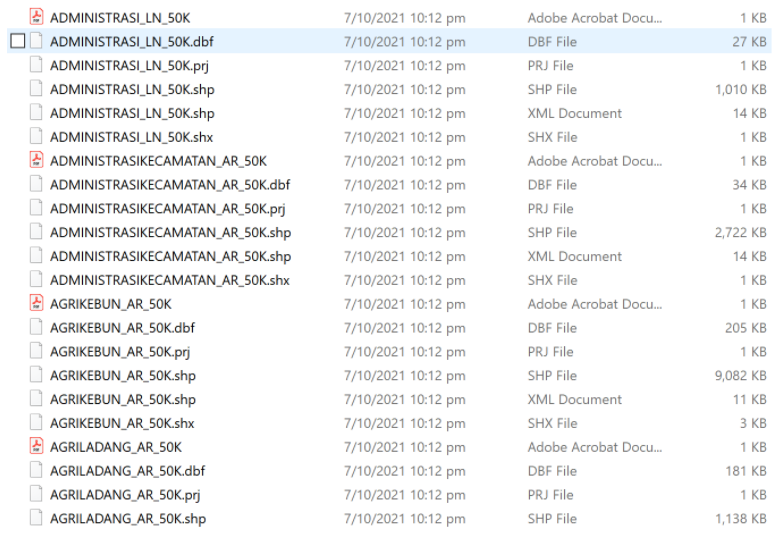
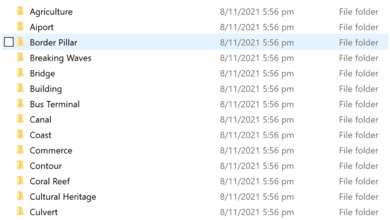
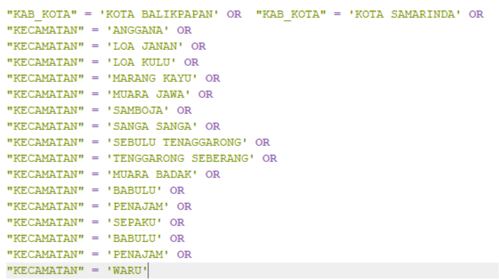
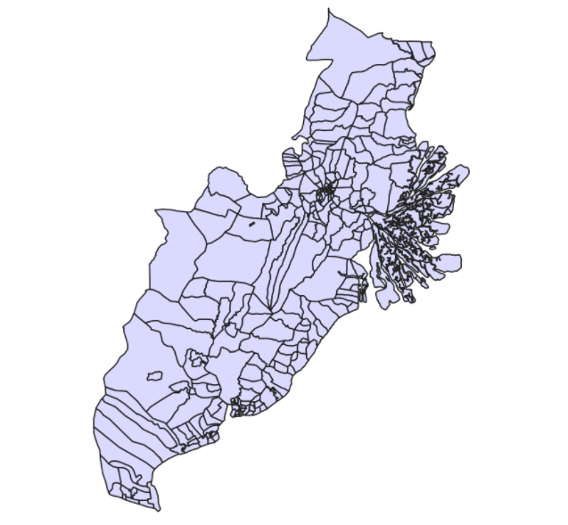
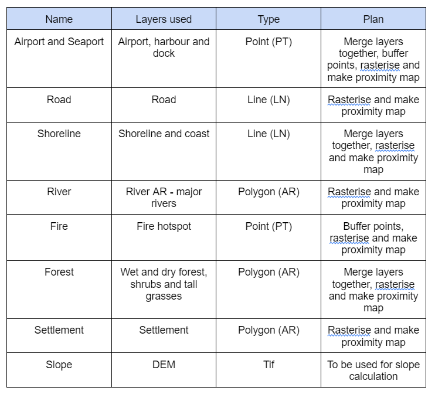
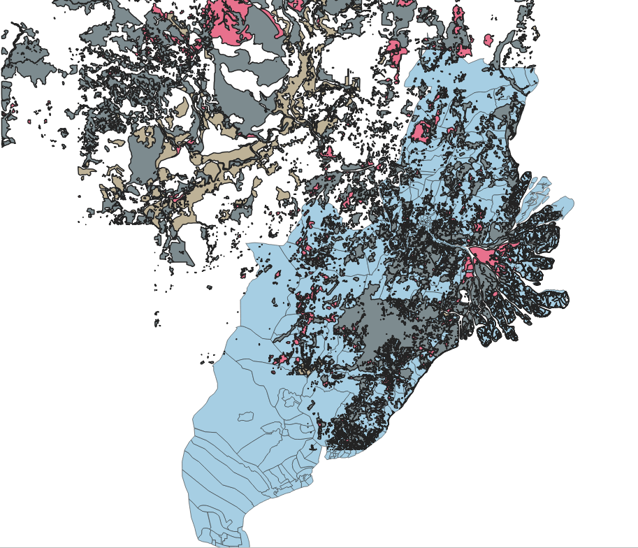
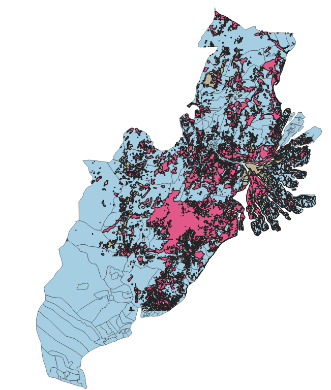
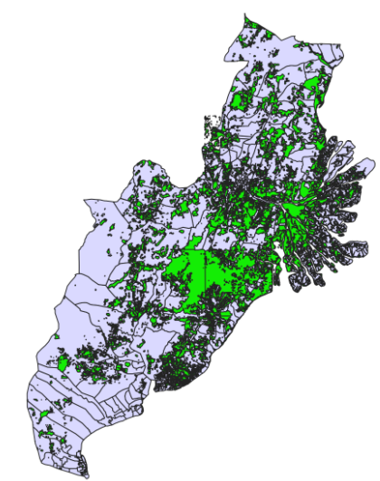
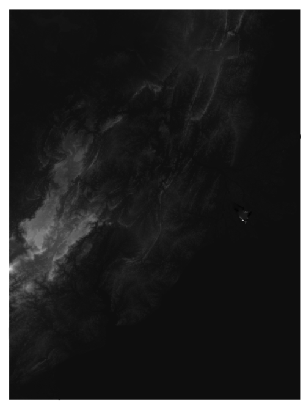

```{r setup, include=FALSE}
knitr::opts_chunk$set(echo = FALSE)
```

## 1. Extraction of data

Extract the following datasets from the given sources.


Save them into a project folder. The folder should look similar to the image below.


## 2. Translating imported data

Translate the file names to English as shown below. 



## 3. Adding data into QGIS

Open a new QGIS project and prepare the study area, following the step below. Indonesia’s CRS is ‘EPSG:23845 - DGN95 / Indonesia TM-3 zone 54.1’. Ensure that all layers follow this CRS.

## 4. Extracting Study Area

Extract the study area by performing a query on ‘BATAS_DESA_DESEMBER_2019_DUKCAPIL_KALIMANTAN_TIMUR.shp’ as seen in the image below. 


Save the selected features in geopackage format. The study area should look like the image below.



## 5. Data Cleaning

Remove layers that are empty:
* Building AR

* Commerce AR

* Education AR

* Exercise PT

* Government AR

* Grave AR

* Hospital AR

* Non Agri Dry Forest

* Park

* Places of worship AR

* Pool PT

* Public Health Center AR

* Public Hydrant

* Radio Broadcast

* Sports Arena AR

* Telephone Booth PT

* Telephone Office PT

* Coast AR

* Communication means

* Defense PT

* Dry Area

* Education AR

* Gas Terminal PT

* Govt AR

* Harbor_dock_AR

* Heliport_PT

* Industry_AR

* Polyclinic

* Pool

* RadioBroadcastTower

* RecyclingCentres_PT

* Runway_PT

* Satellite_PT

* Social

* TaxiStand_AR

* TaxiStand_PT

* Telephone_PT

* TerminalBus_AR

* TrainRailway_LN

* UndergroundTunnel(road)_PT

* Wet_area

* Worship_means_AR

## 6. Layers used

### 6.1 Criteria

The following were the criterias to fulfill when choosing the area to house the new city.

* It should be between 4500-5500 hectares in size

* It should avoid steep slope. Steep slope developments are relative more costly because they involve cut-and-fill and is less environmental friendly.

* It should be away from potential natural disaster risk areas such as sea coasts, major rivers and volcanoes.

* It should be near to current urban settlement areas but not at the current major settlement areas.

* It should avoid natural forest as much as possible.

* It should avoid areas prone to forest fire.

* It should be highly accessible via road transport.
It should be near to airport(s) and seaport(s).

### 6.2 Categorise layers

We grouped these criterias into categories. The categories and what we plan to do with them are:



## 7. Clipping of layers

Since the merged layers are not only limited to the study area, there are unnecessary data outside of our study area. Hence, we have to clip them.

Before:



After:



## 8. Merging Vector layers

We merged all the layers of the same category from different areas into one shapefile

One example of the merged layer, forest is as shown below:



## 9. Saving DEM into geopackage

Since we have a large study area, we used 100x100 for this project. We saved DEM into the geopackage, and clipped it to the study area. 

We will get the following DEM as shown below:


