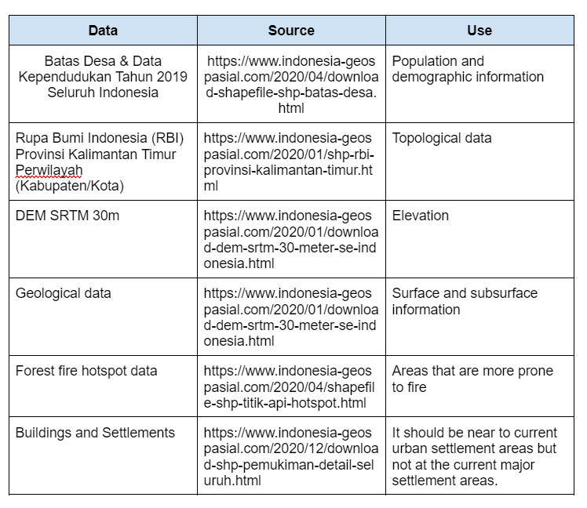
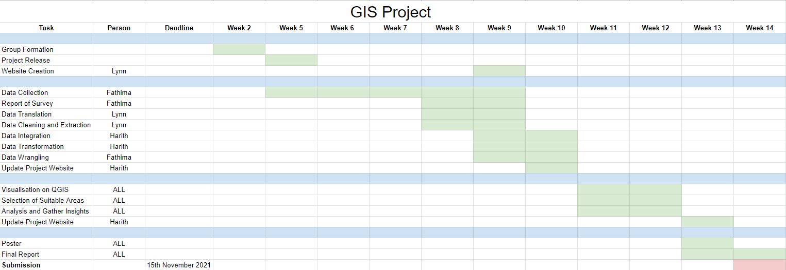

```{r setup, include=FALSE}
knitr::opts_chunk$set(echo = FALSE)
```
## Project proposal

### Motivation of the project

The motivation of this project is to analyse the geospatial characteristics of Kota Balikpapan, Kota Samarinda, selected districts and sub-districts of North Penajam Paser and Kutai Kartanegara Regencies to determine a suitable site to house the new capital city of Indonesia. This is to reduce the overburden on Jakarta as Indonesia’s primary hub and the developmental inequality between Java and other islands.

### Project Objective

We aim to recommend a new capital city for Indonesia based on the geospatial characteristics of the location. The following are the criterias that the selected area must meet:

* It should be between 4500-5500 hectares in size
* It should avoid steep slope. Steep slope developments are relative more costly because they involve cut-and-fill and is less environmental friendly.
* It should be away from potential natural disaster risk areas such as sea coasts, major rivers and volcanoes.
* It should be near to current urban settlement areas but not at the current major settlement areas.
* It should avoid natural forest as much as possible.
* It should avoid areas prone to forest fire.
* It should be highly accessible via road transport.
* It should be near to airport(s) and seaport(s).

We will be looking into the following areas:

* Population and Demographic
* Economic and Businesses
* Transport and Communication
* Infrastructure
* Environment and Hazard

### Data

The following datasets were used: 



### Scope of work

The project will comprise of, but not limited to the followings steps:

* Selection of project area, this year the project area is provided.
* Data collection, extraction, integration, transformation and wrangling.
* Designing and building GIS model and database
* Preparing report of survey
* Performing site suitability analysis by integrating GIS and multi-criteria evaluation methods.
* Preparing site suitability analysis report including detail discussion of the analysing method used.
* Preparing poster and project webpage.

### Project schedule



