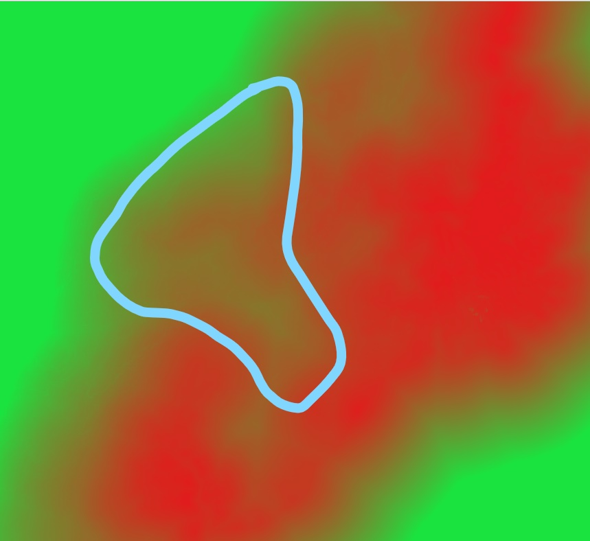
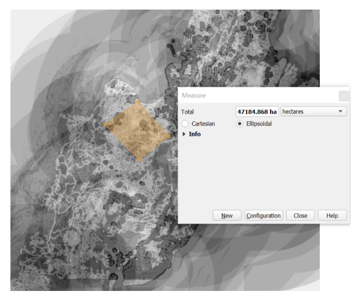
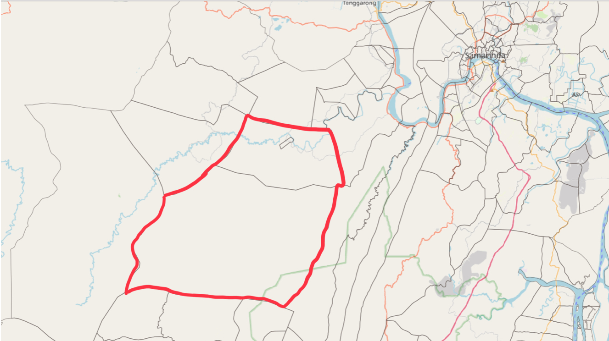

```{r setup, include=FALSE}
knitr::opts_chunk$set(echo = FALSE)
```

### Issues and Problems

* To determine a site suitable to house Indonesia’s new capital city. This would help reduce Jakarta’s burden as Indonesia’s primary hub and reduce developmental inequality between Java and other islands in the Indonesian archipelago.   

* To reduce Jakarta's overcrowding, traffic jams, pollution and the need for growth in East Kalimantan.

### Motivation

The developmental inequality between Java and Kalimantan is concerning as Kalimantan is much larger and with more opportunities than Java but only contributes to 31.49% of the county’s GDP. Java accounts for 8% of the GDP despite being four times smaller.

To analyse the geospatial characteristics of Kota Balikpapan, Kota Samarinda, selected districts and sub-districts of North Penajam Paser and Kutai Kartanegara Regencies to determine a suitable site to house the new capital city of Indonesia.

### Criteria used:
* Shoreline
* River
* Fire
* Road
* Airport and Seaport
* Forest
* Slope
* Settlement

### Approach
* Using AHP analysis as a base to determine the land suitability of the study areas to house the new capital city, and ranking suitability to check against it.

1. Rasterise vector data to create proximity maps for each of the eight criteria

**Ranking method**

2. Rank each of the layer using reclassify by table

3. Add all ranks together

**AHP method**

4. Use Z Score to standardize the data from proximity maps as they have different scales.

5. Perform an AHP analysis to determine the relative importance of each characteristic

6. Using the weightages from the AHP analysis, multiplying them with the standardized score of respective features using the Raster calculator.

7. From the resulting output, we selected an area with composite factor score>0.3

**Comparing both methods**

8. We cross referenced to the results we get from the ranking, and it gave us the same result.
{ width=100% }
AHP analysis suggest that the chosen area should be near the western region of East Kalimantan. 
{ width=100% }
The rank suitability method also suggests the same.

### Future Works
* Take more layers into consideration such as office buildings, education and government when analyzing the area for urbanism.

* Rasterize using 30x30 to ensure more accurate results

### Conclusion
{ width=100% }

Area selected:  Loa Kulu, village of Jongkang in Kutai Kartanegara

While the most ideal location identified is located at Loa Kulu, a village of Jongkang in Kutai Kartanegara, it is also closely located in between the two major cities, Balikpapan and Samarinda. Furthermore, it could take advantage of their existing infrastructure despite it being the least important criteria for our AHP analysis. 

Also, based on the site selected, it is easily accessible to roads and there is both airport and seaport nearby. With this, this new site can potentially solve many of Jakarta’s most pressing issues (traffic, pollution, overpopulation, etc).

As for our most prioritised criteria, fire and shoreline and river, since our AHP analysis received a composite score of 0.3, it indicates that the area is fairly safe from potential disasters and forest fires. Hence, this site is most suitable for the relocation of Indonesia’s new capital city as it meets all criterias listed.


#### Done by:  Fathima, Harith Oh, Lynn Su

### References
https://github.com/brentthorne/posterdown/wiki
