```{r setup, include=FALSE}
knitr::opts_chunk$set(echo = FALSE)
```

# 1. Population and Demographic
## 1.1 Distribution of the number of people aged 15 to 55

Since the working age population in Indonesia is from 15 to 64 years old and the 2021 retirement age is 57, the distribution with people aged from **15 to 55 years old** are to be investigated. As observed from the map, it can be seen that most of these people are located in the **central parts** of Kota Samarinda and Kota Balikpapan. This might be due to having intensive labour and industries in these areas. Also, it is evident that more people prefer to stay closer to coastlines.

## 1.2 Distribution of the number of muslims

As shown above, the patterns are very similar to the distribution aged from 15 to 55 years old which shows that a big majority of those age groups are muslims whereby Islam is the main religion for Indonesians. The map also shows that most of these muslims stay in the central parts of Kota Samarinda and Kota Balikpapan which are both near the coastal areas.

## 1.3 Distribution of the number of people in Other religions

There are not many people with beliefs other than Islam as there are at most 5072 in an area as shown in the map. This includes Christian, Catholic, Hindu, Buddha, Confucianism and Free Thinker. Since the numbers differ largely between Islam and other religions, we are using equal quartiles as a standard method to show the distribution for both maps. The patterns are still similar whereby they are mainly located in Kota Samarinda and Kota Balikpapan. In between Kota Samarinda and Kota Balikpapan, there is a large proportion of them staying at Kota Desu.

## 1.4 Distribution of people with education qualifications

This distribution map includes people who are currently studying in Junior High, high schools and pursuing Diploma in Kalimantan Timur. As shown in the map, these people are mainly located in Kota Balikpapan and Kota Samarinda which are the centralised areas in Kalimantan Timur, having better infrastructure, facilities and resources.

## 1.5 Difference in distribution of males and females

To look into the gender distribution in Kalimantan Timur, we compare the numbers by (number of males - number of females). Majority of the areas have more males than females at most of 1248 while there are only a handful having more females than males by at most 96. This might indicate that males are preferred for labour especially in infrastructure and heavy industries. 


# 2. Economic and Business
## 2.1 Economic and Business In East Kalimantan
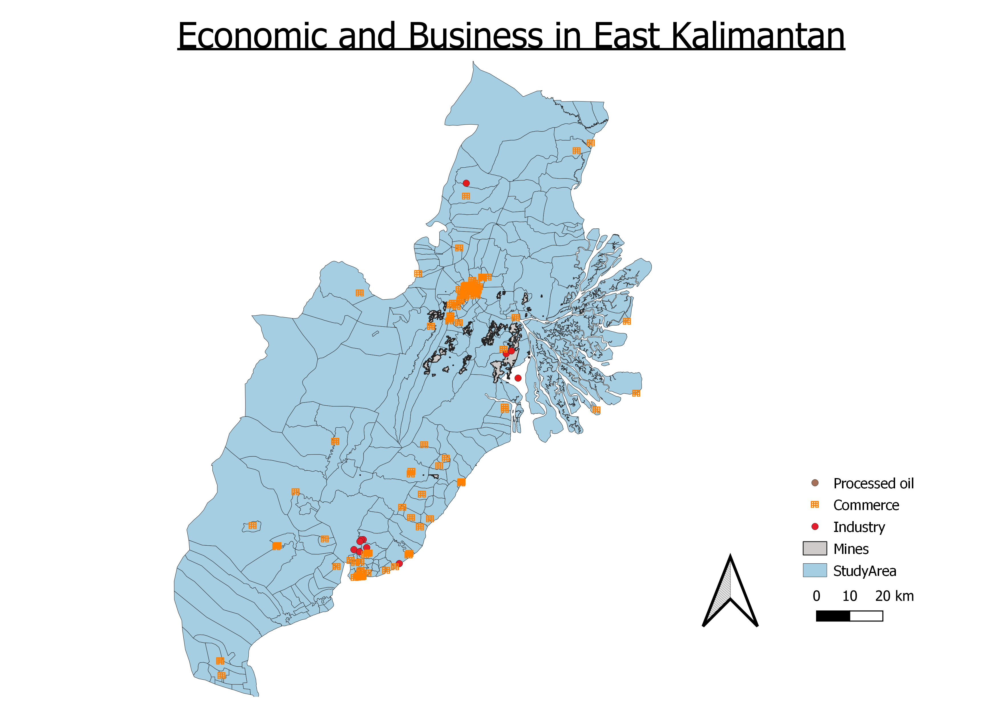
The map above shows the businesses in our study area, which include commercial buildings, industry buildings, mines and processed oil industry. Most of the commerce are clustered in the central area, which is in Samarinda. This is followed by the area near the coast, which is in Balikpapan. There are also a few scattered around our study area. With more commercial buildings clustered in an area, we can infer that these areas are more developed than the rest.

From the map, we can see that most of the mines are located in Samarinda, most of them away from the cluster of commerce areas. We can consider using these areas as part of our new capital as the area has already been cleared.

Industries are mostly located at Samarinda and Balikpapan, with an exception, which is located in Tenggarong Seberang. There are 5 oil processing industries in our study area, with three in Balikpapan, and two in Samarinda.

## 2.2 Agricultural Activities in East Kalimantan
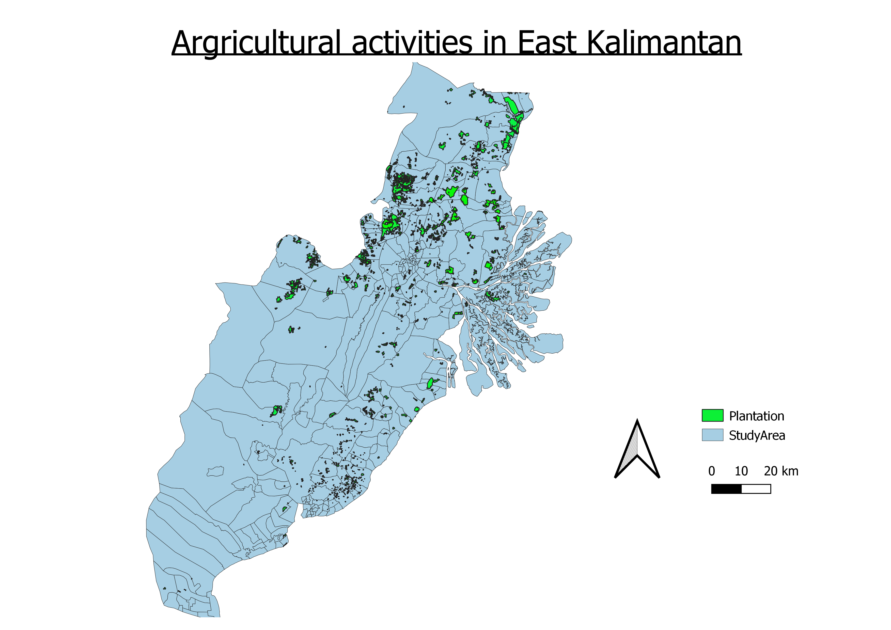
The map above shows the areas of plantation in our study area. No doubt that some agricultural activities are for personal consumption, there are also areas that are for commercial purposes. Larger plantation areas have a higher possibility for having commercial purposes, and we can see that these areas are mostly located at the Kutai Kartanegara regency, which is in the North of our study area. Urban areas would have lesser plantations, hence, we can consider moving to areas with smaller plantations.

# 3. Transport and Communication
## 3.1 Transport in East Kalimantan
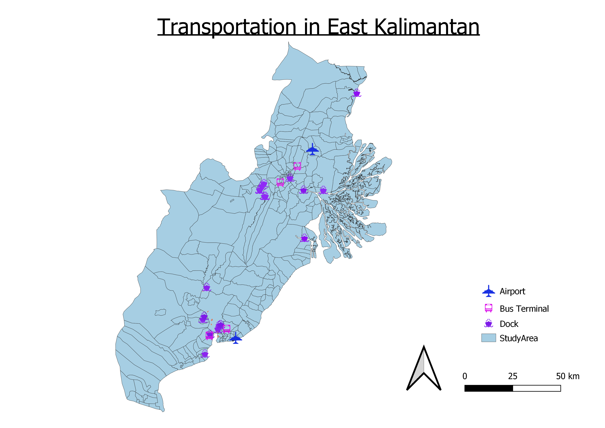
The map above shows the distribution of transportation, which includes airports, bus terminals and docks. There are a total of two airports, one located on the Northern part of our study area, Samarinda, and the other located near the coast on the Southern part at Balikpapan. Most of the bus terminals and docks are also located near these two airports. Airports and seaports help to provide ease to tourists who are coming into the new capital area. Bus terminals also help to allow greater accessibility for travelling. Hence we can consider having our new capital in areas near these transportation.

## 3.2 Roads in East Kalimantan
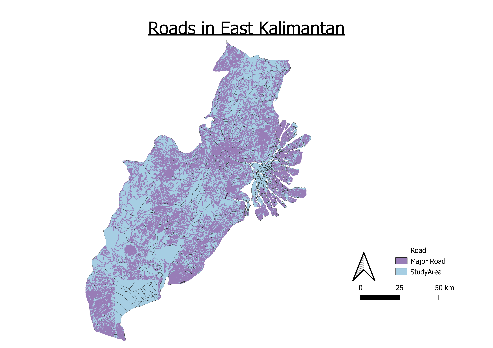
The map above shows the roads in our study area. Most of the areas are well-connected, except for a few spots in Paser Penajam. We would consider having our new capital in areas that are more accessible, which means places where they are well-connected.

## 3.3 Signal Towers in East Kalimantan
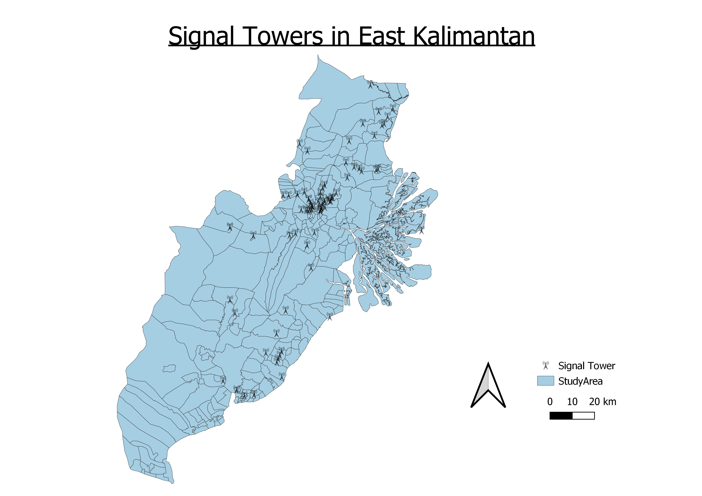
The map above shows the signal tower located in our study area. The biggest cluster is located at Samarinda. There are also multiple signal towers dispersed throughout the study area, except for the area that we are interested in this study in Penjam Pasertara. The greater the cluster of signal towers, we can tell that the place is more urban.

# 4. Infrastructure
Educational Institutions, health facilities, water and irrigation and electrical facilities will be considered to analyse how advanced a region is.

## 4.1 Educational Institutions in East Kalimantan
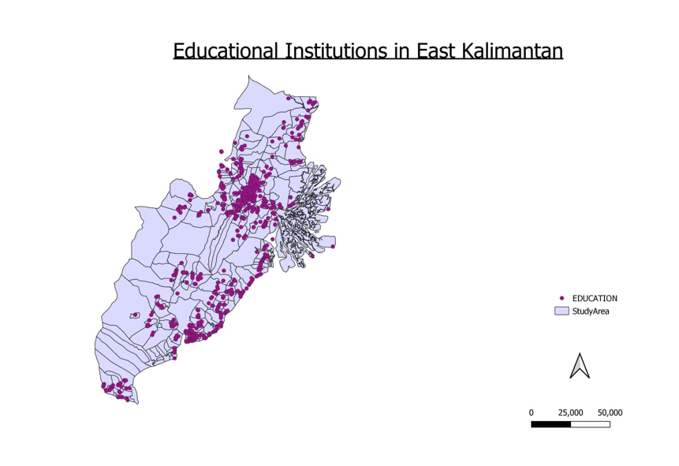
A region’s development is primarily based on its people and its resources. A region with a higher literacy rate will lead to a lower unemployment rate and greater GDP growth. Education is the backbone of any region as it plays a crucial role in technological developments and imparts various skills and values. The map above shows the distribution of educational institutions in East Kalimantan. As seen above, most of the institutions are concentrated in two regions, namely Balikpapan and Samarinda. These are the two most populated regions.

## 4.2 Health Services in East Kalimantan
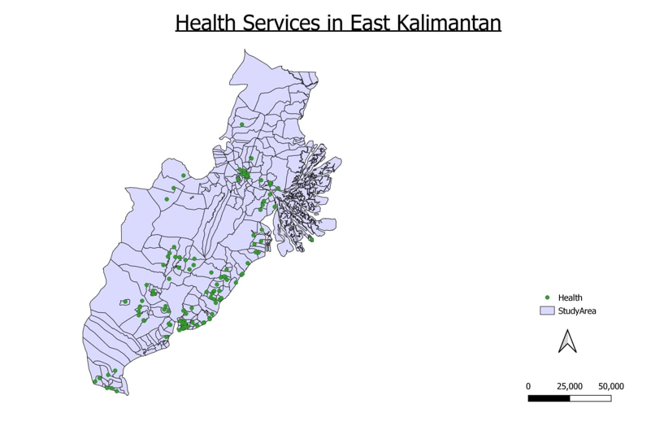
The healthier the citizens of a region, the more effective the workforce. It can be inferred from the map above that there are inadequate medical facilities and health facilities in East kalimantan. There are few points in relative to the size. Most of the facilities seem to be situated in Balikpapan and Samarinda. It is likely because they are more populous and developed.

## 4.3 Water and Irrigation in East Kalimantan
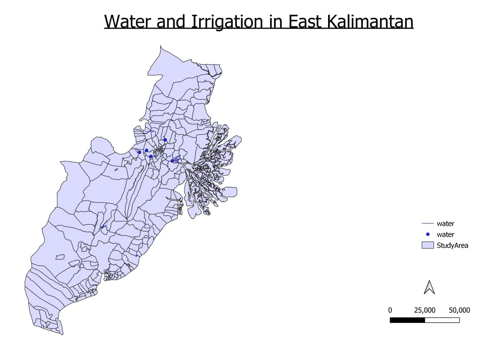
Accessibility water is critical to health, a healthy environment, poverty reduction, a sustainable economy, and peace and security. The map above shows the distribution of drinking water and irrigation in East Kalimantan. There are few irrigation water networks in this area and they are situated mainly in Samarinda and Kutai Kartanegara.

## 4.4 Electrical Facilities in East Kalimantan
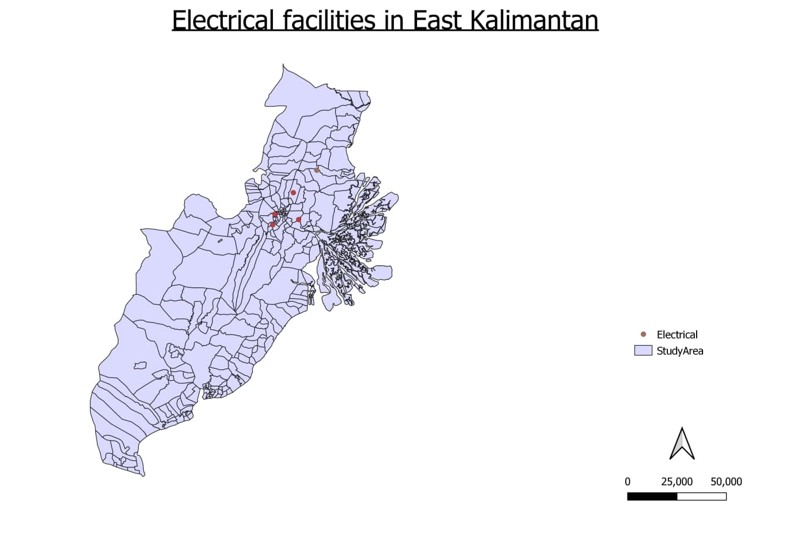
The map above shows the distribution of electrical facilities in East Kalimantan. From the map, we can see the distributions are very uneven. The facilities are mainly located in Kota Samarinda and Kutai Kartanegara. This is likely because Samarinda is the capital city East Kalimantan. 


# 5. Environment and Hazard
## 5.1 Shorelines in East Kalimantan
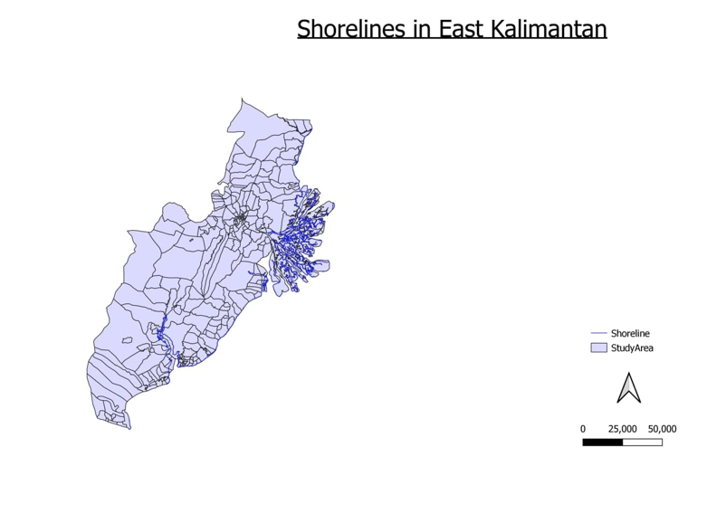
The map above shows the coastlines and shorelines in East Kalimantan. Areas in close proximity to this should be avoided, as they are more prone to hurricanes, coastal storms, tsunamis, and landslides, as well as longer-term risks of coastal erosion and sea level rise.

## 5.2 Distribution of forest and agriculture
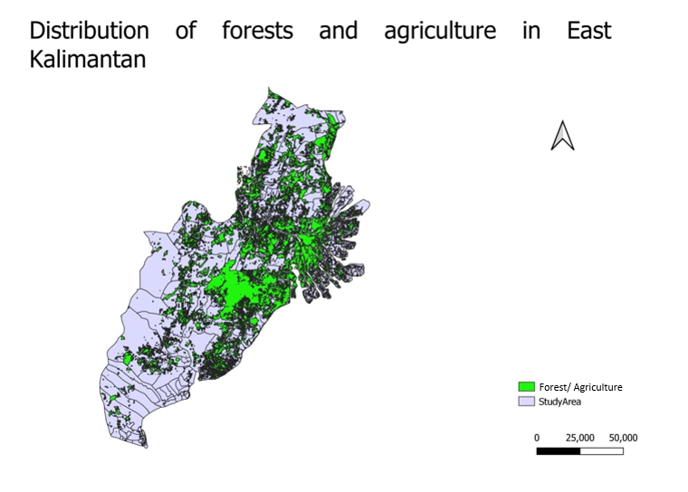
The map above shows the forest and agriculture distribution in East Kalimantan. Layers used for this map include:  high grasses, bushes, wet forest, non agri shrubs, plantation, paddy fields, irrigation. As seen above, Balikpapan and the South of Kutai Kartanegara is heavily forested.

## 5.3 Fire Hotspots in Kalimantan
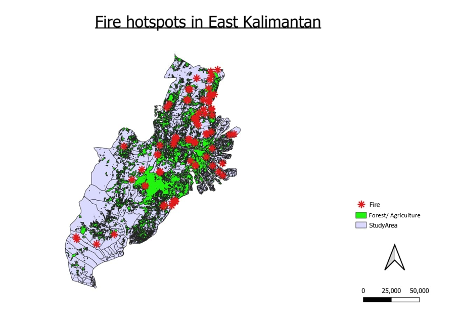
There are several fire hotspots in East Kalimantan. Most of the hotspots coincide with forests. The burning usually peaks during Indonesia's dry season. The problem has accelerated in recent years as more land has been cleared for expanding plantations for the palm oil trade.

