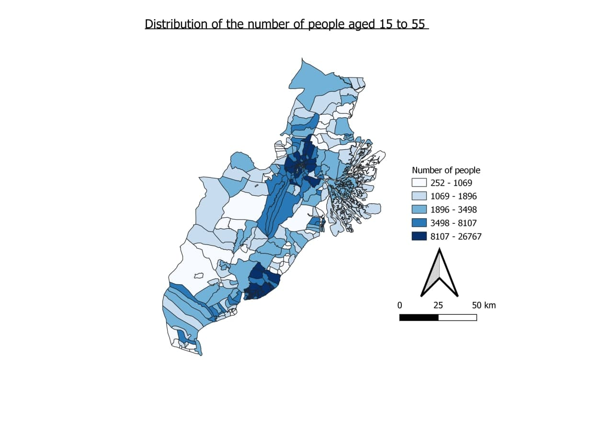
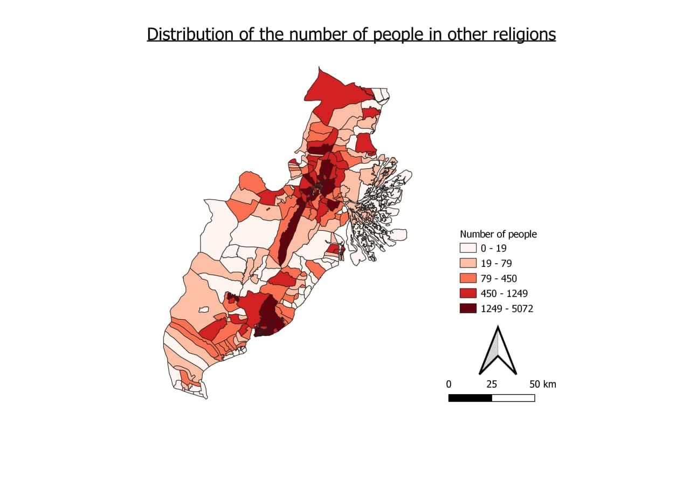
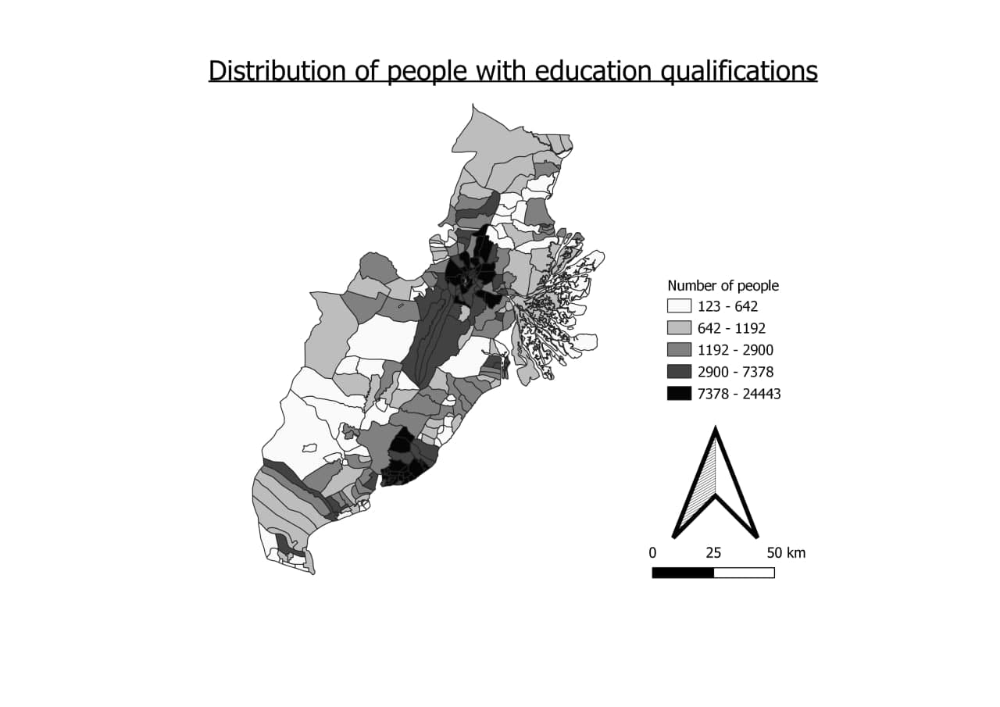
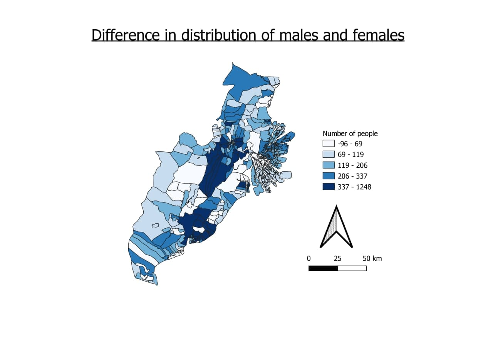

```{r setup, include=FALSE}
knitr::opts_chunk$set(echo = FALSE)
```

# 1. Population and Demographic

## 1.1 Distribution of the number of people aged 15 to 55

Since the working age population in Indonesia is from 15 to 64 years old and the 2021 retirement age is 57, the distribution with people aged from **15 to 55 years old** are to be investigated. As observed from the map, it can be seen that most of these people are located in the **central parts** of Kota Samarinda and Kota Balikpapan. This might be due to having intensive labour and industries in these areas. Also, it is evident that more people prefer to stay closer to coastlines.

## 1.2 Distribution of the number of muslims

As shown above, the patterns are very similar to the distribution aged from 15 to 55 years old which shows that a big majority of those age groups are muslims whereby Islam is the main religion for Indonesians. The map also shows that most of these muslims stay in the central parts of Kota Samarinda and Kota Balikpapan which are both near the coastal areas.

## 1.3 Distribution of the number of people in Other religions

There are not many people with beliefs other than Islam as there are at most 5072 in an area as shown in the map. This includes Christian, Catholic, Hindu, Buddha, Confucianism and Free Thinker. Since the numbers differ largely between Islam and other religions, we are using equal quartiles as a standard method to show the distribution for both maps. The patterns are still similar whereby they are mainly located in Kota Samarinda and Kota Balikpapan. In between Kota Samarinda and Kota Balikpapan, there is a large proportion of them staying at Kota Desu.

## 1.4 Distribution of people with education qualifications

This distribution map includes people who are currently studying in Junior High, high schools and pursuing Diploma in Kalimantan Timur. As shown in the map, these people are mainly located in Kota Balikpapan and Kota Samarinda which are the centralised areas in Kalimantan Timur, having better infrastructure, facilities and resources.

## 1.5 Difference in distribution of males and females

To look into the gender distribution in Kalimantan Timur, we compare the numbers by (number of males - number of females). Majority of the areas have more males than females at most of 1248 while there are only a handful having more females than males by at most 96. This might indicate that males are preferred for labour especially in infrastructure and heavy industries. 
